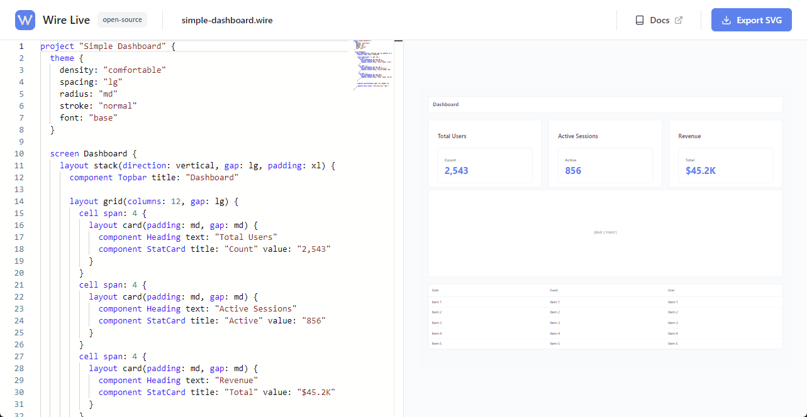

# 🎨 WireDSL

> **Wireframes as Code.** Declarative wireframing with AI-friendly syntax.

[](https://opensource.org/licenses/MIT)
[](https://www.npmjs.com/package/@wire-dsl/engine)
[](https://github.com/wire-dsl/wire-dsl/actions)
[](https://nodejs.org/)
[](https://www.typescriptlang.org/)

## What is WireDSL?

WireDSL is a **code-first wireframing tool** that lets you:

- ✍️ **Write wireframes as declarative code** (like Mermaid, but for UI)
- 🤖 **Generate from plain English** ("Create a login form..." → automatic wireframe)
- 📦 **Export to SVG, PNG, PDF**
- 🔓 **100% open-source** and free forever
- ⚙️ **AI-friendly syntax** for LLM-powered generation

## 🚀 Quick Start

**Try online (no installation needed):**

Visit [**live.wire-dsl.org**](https://live.wire-dsl.org) to use the web editor in your browser.

**Start the web editor locally (connected to your files):**

```bash
pnpm install && cd apps/web && pnpm dev
```

→ Open http://localhost:3000

**Try the CLI (one-liner):**

```bash
npm install -g @wire-dsl/cli && wire render examples/simple-dashboard.wire -o output.svg
```

**Use as a library:**

```bash
npm install @wire-dsl/engine
import { parseWireDSL, generateIR } from '@wire-dsl/engine';
```

## 🎬 Demo: `.wire` Code → SVG Preview

> Live editor showing:
> - Left: `.wire` code in Monaco editor
> - Right: Real-time SVG preview (hot reload)
> - Changes appear instantly as you type
>
> 
> *Note: screenshot from Wire Live on [live.wire-dsl.org](https://live.wire-dsl.org/).*

---

## 📖 First Time? Read This

1. **[QUICKSTART.md](./QUICKSTART.md)** - Setup guide (5 minutes)
2. **[MONOREPO.md](./MONOREPO.md)** - How the project is organized (10 minutes)
3. **[docs/DOCUMENTATION-INDEX.md](./docs/DOCUMENTATION-INDEX.md)** - Complete documentation index

## 📚 Full Documentation

**Getting Started**

- **[QUICKSTART.md](./QUICKSTART.md)** - Get up and running
- **[MONOREPO.md](./MONOREPO.md)** - Project structure
- **[docs/DOCUMENTATION-INDEX.md](./docs/DOCUMENTATION-INDEX.md)** - Complete documentation index
- **[.github/CONTRIBUTING.md](./.github/CONTRIBUTING.md)** - Contributing guide

**Technical & Design**

- **[docs/ARCHITECTURE.md](./docs/ARCHITECTURE.md)** - System design
- **[docs/DSL-SYNTAX.md](./docs/DSL-SYNTAX.md)** - Language syntax guide
- **[docs/THEME-GUIDE.md](./docs/THEME-GUIDE.md)** - Theme system documentation
- **[docs/LLM-PROMPTING.md](./docs/LLM-PROMPTING.md)** - Guide for AI generation from natural language
- **[docs/ICONS-GUIDE.md](./docs/ICONS-GUIDE.md)** - Icons library and usage
- **[docs/ICON-AND-BUTTON-SIZING.md](./docs/ICON-AND-BUTTON-SIZING.md)** - Icon and button sizing guide

**Component & Container References**

- **[specs/IR-CONTRACT.md](./specs/IR-CONTRACT.md)** - Intermediate representation format
- **[specs/LAYOUT-ENGINE.md](./specs/LAYOUT-ENGINE.md)** - Layout algorithms
- **[specs/VALIDATION-RULES.md](./specs/VALIDATION-RULES.md)** - Validation rules

**Planning & Roadmap**

- **[docs/ROADMAP.md](./docs/ROADMAP.md)** - Future features and milestones

**Examples**

- **[examples/](./examples/)** - Complete working examples

---

## 🎯 Why WireDSL?

WireDSL is a platform for creating declarative wireframes where:

- ✍️ **You declare**, you don't draw
- 🤖 **AI-friendly**: predictable syntax for automatic generation
- 📐 **Deterministic**: same input → same output
- 🔄 **Versionable**: wireframes are code

### Quick Example

```wire
project "Dashboard" {
  theme {
    density: "normal"
    spacing: "md"
    radius: "md"
    stroke: "normal"
    font: "base"
  }

  screen Home {
    layout stack(direction: vertical, gap: md, padding: lg) {
      component Heading title: "Welcome"
      component Button text: "Get Started"
    }
  }
}
```

## 📦 Packages & Apps

| Package/App                                          | Purpose                        | Status         |
| ---------------------------------------------------- | ------------------------------ | -------------- |
| [@wire-dsl/engine](./packages/engine)               | Parser, IR, layout, renderer   | ✅ Published   |
| [@wire-dsl/exporters](./packages/exporters)         | SVG, PNG, PDF export (Node.js) | ✅ Published   |
| [@wire-dsl/cli](./packages/cli)                     | Command-line tool              | ✅ Published   |
| [@wire-dsl/language-support](./packages/language-support) | VS Code syntax & type support  | ✅ Published   |
| [wire-dsl/web](./apps/web)                          | Live web editor                | ✅ Published   |
| [wire-dsl/docs](./apps/docs)                        | Documentation site             | ✅ Published   |

## 🎯 Example Workflow

### 1. Write Wireframe Code

```wire
project "Login Form" {
  theme {
    density: "normal"
    spacing: "md"
    radius: "md"
    stroke: "normal"
    font: "base"
  }

  screen LoginScreen {
    layout panel(padding: lg, background: "white") {
      layout stack(direction: vertical, gap: md) {
        component Heading title: "Sign In"
        component Input label: "Email" placeholder: "your@email.com"
        component Input label: "Password" placeholder: "••••••••"
        component Checkbox label: "Remember me"
        component Button text: "Sign In" variant: primary
      }
    }
  }
}
```

### 2. See Live Preview

- Monaco editor on the left
- SVG preview on the right
- Hot reload as you type

### 3. Generate with AI

```
User: "Create a login form with email, password, and remember me"
→ LLM generates .wire code
→ Preview appears instantly
→ Edit if needed
```

### 4. Export

- SVG (scale to any size)
- PNG (with optional resizing)
- PDF (multipage support)

## 🛠️ Tech Stack

**Core**

- TypeScript 5.3 (strict mode)
- Chevrotain 11.x (parser)
- Zod 4.x (validation)

**Web Editor**

- React
- Vite
- Monaco Editor
- Tailwind CSS

**DevOps**

- pnpm + Turborepo
- Vitest (testing)
- GitHub Actions (CI/CD)
- Changesets (versioning)

**Deployment**

- Cloudflare Pages (web editor)
- NPM (CLI tool)

## 📊 Architecture

```
.wire (text)
   ↓
Parser (Chevrotain)
   ↓
AST (tokens)
   ↓
IR Generator
   ↓
IR Contract (JSON)
   ↓
Layout Engine
   ↓
Positioned Elements
   ↓
SVG Renderer
   ↓
SVG / PNG / PDF
```

## 🚢 Deployment

- **Web Editor**: Automatic via Cloudflare Pages (git push → live)
- **CLI Tool**: Automatic via GitHub Actions + NPM (changesets → publish)

## 📦 What's Included

**Free & Open Source**

- ✅ Engine library (@wire-dsl/engine) - Pure TypeScript parser + layout
- ✅ Exporters library (@wire-dsl/exporters) - SVG, PNG, PDF output
- ✅ CLI tool (@wire-dsl/cli) - Command-line rendering
- ✅ Language support (@wire-dsl/language-support) - VS Code integration
- ✅ Web editor - Live editing and preview with AI integration
- ✅ Full source code on GitHub

## 🤝 Contributing

We welcome contributions! See [CONTRIBUTING.md](./.github/CONTRIBUTING.md).

**Quick start:**

```bash
git checkout -b feature/your-feature
cd packages/engine
pnpm test:watch
# Make changes
git commit -m "feat(engine): your feature"
git push origin feature/your-feature
# Create PR
```

## 🔗 Links

- **Website**: https://wire-dsl.org - Official documentation site
- **Live Editor**: https://live.wire-dsl.org - Try WireDSL in your browser
- **GitHub**: https://github.com/wire-dsl/wire-dsl
- **NPM Org**: https://www.npmjs.com/org/wire-dsl
- **Issues**: [GitHub Issues](https://github.com/wire-dsl/wire-dsl/issues)
- **Discussions**: [GitHub Discussions](https://github.com/wire-dsl/wire-dsl/discussions)

## 📄 License

MIT License - Free for personal and commercial use

## ⚖️ Third-Party Components & Assets

### Feather Icons

This project includes icons from [Feather Icons](https://feathericons.com), created by Cole Bemis and contributors.

- **License**: MIT License
- **Repository**: https://github.com/feathericons/feather
- **Location in project**: `packages/engine/src/renderer/icons/`
- **Full details**: See `packages/engine/src/renderer/icons/ICONS-LICENSE.md`

Feather Icons are used under the terms of the MIT License, which is fully compatible with this project's MIT License.

## ✨ Why WireDSL vs Mermaid/Excalidraw?

| Aspect | WireDSL | Mermaid | Excalidraw |
|--------|---------|---------|--------------|
| **UI/UX focused** | ✅ 30+ UI components | ❌ Diagrams only | ✅ Visual sketches |
| **Code-first** | ✅ Full DSL | ✅ Limited syntax | ❌ GUI-only |
| **AI-generation ready** | ✅ Predictable syntax | ⚠️ Works OK | ❌ Not designed for AI |
| **Version control friendly** | ✅ Text diffs work great | ✅ Text-based | ❌ Binary format |
| **Export formats** | ✅ SVG, PNG, PDF | ❌ Limited | ✅ SVG, PNG |

**TL;DR:** Mermaid for diagrams, Excalidraw for sketches, **WireDSL for code-first interactive wireframes**.

## 🙏 Acknowledgments

Inspired by:

- **Mermaid** - Diagrams as code
- **Figma** - Design systems
- **React** - Component-based UIs
- **DSL design patterns** - Language engineering

## 📈 Roadmap

**Phase 1** ✅ (Completed)

- ✅ Parser implementation
- ✅ IR generator
- ✅ Layout engine
- ✅ SVG renderer
- ✅ Web editor MVP
- ✅ CLI tool
- ✅ PNG/PDF export

**Phase 2** ✅ (Completed)

- ✅ Theme system with design tokens
- ✅ 23+ built-in components
- ✅ Component composition & validation
- ✅ Complete documentation

**Phase 3** ✅ (Completed)

- ✅ VS Code extension with syntax highlighting
- ✅ Real-time error detection
- ✅ Component intellisense
- ✅ Document formatting
- ✅ Live preview pane
- 🔗 [GitHub Repository](https://github.com/Wire-DSL/vscode-extension) | [VS Code Marketplace](https://marketplace.visualstudio.com/items?itemName=wire-dsl.wire-dsl)

**Phase 4** 🚀 (Current)

- [ ] **Source maps** - Map `.wire` source to rendered components
- [ ] LSP (Language Server Protocol) support
- [ ] Enhanced debugging capabilities

**Future Features**

- Code generation (React/Vue templates)
- Figma import/export
- Real-time collaboration
- *...and more exciting features in the pipeline! 🎉*

## 👥 Status

```
✅ Phase 1: Core MVP (completed)
✅ Phase 2: Theme System & Design Tokens (completed)
✅ Phase 3: VS Code Extension (completed)

🚀 Phase 4: Source Maps (in progress)
   ├─ Source map generation
   ├─ Debugging support
   └─ Error reporting with precise locations

📅 LSP support (planned)
📅 Code generation (planned)
📅 More features in the pipeline 🎉
```

---

**Last Updated**: February 6, 2026  
**Status**: ✅ Production-Ready, Open Source  
**Next**: Visit [live.wire-dsl.org](https://live.wire-dsl.org) to try it now!
